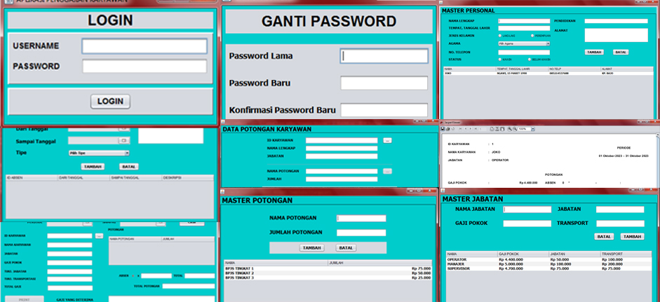

<!-- Improved compatibility of back to top link: See: https://github.com/othneildrew/Best-README-Template/pull/73 -->
<a name="readme-top"></a>

<!-- PROJECT SHIELDS -->
<!--
*** I'm using markdown "reference style" links for readability.
*** Reference links are enclosed in brackets [ ] instead of parentheses ( ).
*** See the bottom of this document for the declaration of the reference variables
*** for contributors-url, forks-url, etc. This is an optional, concise syntax you may use.
*** https://www.markdownguide.org/basic-syntax/#reference-style-links
[![Contributors][contributors-shield]][contributors-url]
-->


<!-- PROJECT LOGO -->
<br />
<div align="center">
  <a href="https://github.com/dhondoi/Java-Aplikasi-Penggajian-Karyawan">
    
  </a>

  <h3 align="center">Aplikasi Penggajian Karyawan</h3>

  <p align="center">
    <!--
    <br />
    <a href="https://github.com/othneildrew/Best-README-Template"><strong>Explore the docs »</strong></a>
    <br />
    <br />
    <a href="https://github.com/othneildrew/Best-README-Template">View Demo</a>
    ·
    <a href="https://github.com/othneildrew/Best-README-Template/issues">Report Bug</a>
    ·
    <a href="https://github.com/othneildrew/Best-README-Template/issues">Request Feature</a>
    -->
  </p>
</div>


<!-- TABLE OF CONTENTS -->
<details>
  <summary>Table of Contents</summary>
      <ul>
          <li><a href="#about-the-project">About The Project</a></li>
          <li><a href="#features">Features</a></li>
          <li><a href="#built-with">Built With</a></li>
          <li><a href="#roadmap">Roadmap</a></li>
      </ul>
  <!--
  <ol>
    <li>
    </li>
    <li>
      <a href="#getting-started">Getting Started</a>
      <ul>
        <li><a href="#prerequisites">Prerequisites</a></li>
        <li><a href="#installation">Installation</a></li>
      </ul>
    </li>
    <li><a href="#usage">Usage</a></li>
    <li><a href="#roadmap">Roadmap</a></li>
    <li><a href="#contributing">Contributing</a></li>
    <li><a href="#license">License</a></li>
    <li><a href="#contact">Contact</a></li>
    <li><a href="#acknowledgments">Acknowledgments</a></li>
  </ol>
  -->
</details>

<!-- ABOUT THE PROJECT -->
## About The Project

Tujuan utama dari aplikasi ini adalah membuat laporan gaji tiap karyawan. Sebelum Laporan gaji karyawan dihasilkan, diperlukan beberapa proses bisnis.

![Workflow Aplikasi][workflow-aplikasi]

Untuk rancangan database-nya adalah sebagai berikut.

![Rancangan Database][database-schema]

<p align="right">(<a href="#readme-top">back to top</a>)</p>

## Features

### Login

![Login Menu][login-menu]

### Manajemen Data Pelamar

![Personal Menu][personal-menu]

### Manajemen Data Jabatan

![Role Menu][role-menu]

### Manajemen Data Potongan

![Deduction Menu][deduction-menu]

### Manajemen Data Potongan Setiap Karyawan

![Deduction Employee Menu][deduction-employee-menu]

### Manajemen Data Absen Setiap Karyawan Karyawan

![Absent Menu][absent-menu]

### Laporan Gaji Karyawan

![Report Menu][report-menu]
![Report Menu][report-menu-2]

### Ganti Password User Aplikasi

![Cahnge Password Menu][change-password-menu]

<p align="right">(<a href="#readme-top">back to top</a>)</p>

## Built With

Untuk membuat Aplikasi ini ada beberapa teknologi yang dibutuhkan.

* [![Netbeans][netbeans]][netbeans-url]
* [![Java][java]][java-url]
* **[XAMPP][xampp-url]**

<p align="right">(<a href="#readme-top">back to top</a>)</p>

## Roadmap

- [ ] Ada issue pada JRE saat membuat report.

<p align="right">(<a href="#readme-top">back to top</a>)</p>

<!-- GETTING STARTED 
## Getting Started

This is an example of how you may give instructions on setting up your project locally.
To get a local copy up and running follow these simple example steps.

### Prerequisites

This is an example of how to list things you need to use the software and how to install them.
* npm
  ```sh
  npm install npm@latest -g
  ```

### Installation

_Below is an example of how you can instruct your audience on installing and setting up your app. This template doesn't rely on any external dependencies or services._

1. Get a free API Key at [https://example.com](https://example.com)
2. Clone the repo
   ```sh
   git clone https://github.com/your_username_/Project-Name.git
   ```
3. Install NPM packages
   ```sh
   npm install
   ```
4. Enter your API in `config.js`
   ```js
   const API_KEY = 'ENTER YOUR API';
   ```

<p align="right">(<a href="#readme-top">back to top</a>)</p>

-->

<!-- USAGE EXAMPLES 
## Usage

Use this space to show useful examples of how a project can be used. Additional screenshots, code examples and demos work well in this space. You may also link to more resources.

_For more examples, please refer to the [Documentation](https://example.com)_

<p align="right">(<a href="#readme-top">back to top</a>)</p>

-->

<!-- ROADMAP 
## Roadmap

- [x] Add Changelog
- [x] Add back to top links
- [ ] Add Additional Templates w/ Examples
- [ ] Add "components" document to easily copy & paste sections of the readme
- [ ] Multi-language Support
    - [ ] Chinese
    - [ ] Spanish

See the [open issues](https://github.com/othneildrew/Best-README-Template/issues) for a full list of proposed features (and known issues).

<p align="right">(<a href="#readme-top">back to top</a>)</p>

-->

<!-- CONTRIBUTING 
## Contributing

Contributions are what make the open source community such an amazing place to learn, inspire, and create. Any contributions you make are **greatly appreciated**.

If you have a suggestion that would make this better, please fork the repo and create a pull request. You can also simply open an issue with the tag "enhancement".
Don't forget to give the project a star! Thanks again!

1. Fork the Project
2. Create your Feature Branch (`git checkout -b feature/AmazingFeature`)
3. Commit your Changes (`git commit -m 'Add some AmazingFeature'`)
4. Push to the Branch (`git push origin feature/AmazingFeature`)
5. Open a Pull Request

<p align="right">(<a href="#readme-top">back to top</a>)</p>

-->

<!-- LICENSE 
## License

Distributed under the MIT License. See `LICENSE.txt` for more information.

<p align="right">(<a href="#readme-top">back to top</a>)</p>

-->

<!-- CONTACT 
## Contact

Your Name - [@your_twitter](https://twitter.com/your_username) - email@example.com

Project Link: [https://github.com/your_username/repo_name](https://github.com/your_username/repo_name)

<p align="right">(<a href="#readme-top">back to top</a>)</p>

-->

<!-- ACKNOWLEDGMENTS 
## Acknowledgments

Use this space to list resources you find helpful and would like to give credit to. I've included a few of my favorites to kick things off!

* [Choose an Open Source License](https://choosealicense.com)
* [GitHub Emoji Cheat Sheet](https://www.webpagefx.com/tools/emoji-cheat-sheet)
* [Malven's Flexbox Cheatsheet](https://flexbox.malven.co/)
* [Malven's Grid Cheatsheet](https://grid.malven.co/)
* [Img Shields](https://shields.io)
* [GitHub Pages](https://pages.github.com)
* [Font Awesome](https://fontawesome.com)
* [React Icons](https://react-icons.github.io/react-icons/search)

<p align="right">(<a href="#readme-top">back to top</a>)</p>

-->

<!-- MARKDOWN LINKS & IMAGES -->
<!-- https://www.markdownguide.org/basic-syntax/#reference-style-links -->
<!--
[contributors-shield]: https://img.shields.io/github/contributors/othneildrew/Best-README-Template.svg?style=for-the-badge
[contributors-url]: https://github.com/othneildrew/Best-README-Template/graphs/contributors
[forks-shield]: https://img.shields.io/github/forks/othneildrew/Best-README-Template.svg?style=for-the-badge
[forks-url]: https://github.com/othneildrew/Best-README-Template/network/members
[stars-shield]: https://img.shields.io/github/stars/othneildrew/Best-README-Template.svg?style=for-the-badge
[stars-url]: https://github.com/othneildrew/Best-README-Template/stargazers
[issues-shield]: https://img.shields.io/github/issues/othneildrew/Best-README-Template.svg?style=for-the-badge
[issues-url]: https://github.com/othneildrew/Best-README-Template/issues
[license-shield]: https://img.shields.io/github/license/othneildrew/Best-README-Template.svg?style=for-the-badge
[license-url]: https://github.com/othneildrew/Best-README-Template/blob/master/LICENSE.txt
[linkedin-shield]: https://img.shields.io/badge/-LinkedIn-black.svg?style=for-the-badge&logo=linkedin&colorB=555
[linkedin-url]: https://linkedin.com/in/othneildrew
-->


<!-- LINK BADGE & IMAGE-->
<!-- https://github.com/Ileriayo/markdown-badges -->

[product-screenshot]: images/splash_screen.jpg

[workflow-aplikasi]: images/workflow-aplikasi.jpg
[database-schema]: images/database-schema.png

[login-menu]: images/login-menu.png
[personal-menu]: images/personal-menu.png
[role-menu]: images/role-menu.png
[deduction-menu]: images/deduction-menu.png
[deduction-employee-menu]: images/deduction-employee-menu.png
[absent-menu]: images/absent-menu.png
[report-menu]: images/report-menu.png
[report-menu-2]: images/report-menu-2.png
[change-password-menu]: images/change-password-menu.png

[netbeans]: https://img.shields.io/badge/NetBeansIDE-1B6AC6.svg?style=for-the-badge&logo=apache-netbeans-ide&logoColor=white
[netbeans-url]: https://netbeans.apache.org/
[java]: https://img.shields.io/badge/java-%23ED8B00.svg?style=for-the-badge&logo=openjdk&logoColor=white
[java-url]: https://openjdk.org/
[xampp-url]: https://www.apachefriends.org/
